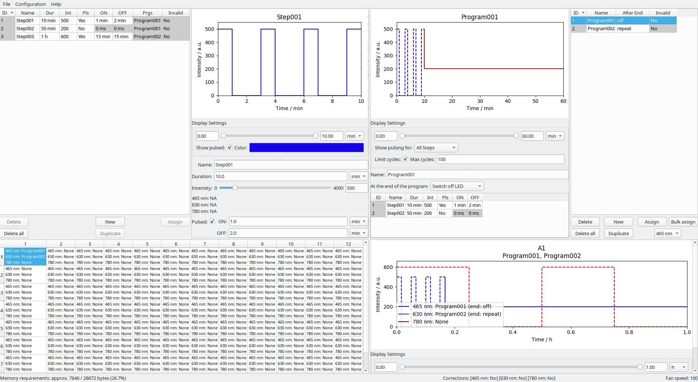

# optoConfig-96 - Interactive configuration of experiments using the optoPlate-96

optoConfig-96 is a software providing a graphical user interface for quick configuration of experiments using the [optoPlate-96 illumination device](https://www.nature.com/articles/s41596-019-0178-y).

## Installation Instructions

optoConfig-96 is available as a Python package or as standalone bundles for Windows 10 and MacOS 10.15.

### Windows 10
1. Download the .zip archive from the GitHub _Releases_ page.
1. Extract the archive to a location of your choice.
1. Run _optoConfig-96.exe_. You may be asked to allow execution of the application.

### MacOS
1. Download the .dmg disk image from the GitHub _Releases_ page.
1. Open the disk image and drag the application to the _Applications_ folder as indicated (or to another location of your choice).
1. You may be asked to allow execution of a foreign application. To do this, go to *System Preferences > Security & Privacy > General* and grant optoConfig-96 permission to run.

### As a Python package
1. Clone the repository or download the package from the GitHub _Releases_ page. The package is not yet on [PyPI](https://www.pypi.org).
    1. If you cloned the repository, you will first have to prepare the package by running `python setup.py build sdist`.
    1. The package will be created at `dist/optoConfig96-x.x.x.tar.gz`, where `x.x.x` denotes the current version.
1. Make sure you have Python 3.7 or Python 3.8 installed by running `python --version` in a terminal.
1. We strongly recommend to use a Python virtual environment. To create one, run `python -m venv optoconfig_venv`, then activate it:
    1. On Mac/Linux: `source optoconfig_venv/scripts/bin/activate`
    1. On Windows: `optoconfig_venv\Scripts\activate`
1. Install the package in the previously activated virtual environment:

    `pip install dist/optoConfig96-x.x.x.tar.gz`.

    This will also download and install all necessary dependencies.
1. In the activated virtual environment, run `python -m optoConfig96` to start the application.

## Usage

For usage instructions, please refer to the the usage guide.

You can open several example files under *Help > Examples*. These mostly replicate the [quality control scripts provided with the optoPlate-96](https://github.com/BugajLab/optoPlate-96/tree/master/2.%20Code/1.%20Arduino/2.%20QCscripts). They turn on the blue, red or far red LEDs of the three-color optoPlate96 for rows with even or odd numbers, respectively. After 30 seconds, the LEDs are turned off.

If you identify issues while configurating or running your illumination protocols, please contact us!
