User guide for version 1.0.0.

[//]: # (TableOfContents)

## Installation Instructions

optoConfig-96 is available as a Python package or as standalone bundles for Windows 10 and MacOS 10.15. Installation should not take more than 5 minutes.

### Windows 10
1. Download the .zip archive from the GitHub _Releases_ page.
1. Extract the archive to a location of your choice.
1. Run _optoConfig-96.exe_. You may be asked to allow execution of the application.

### MacOS
1. Download the .dmg disk image from the GitHub _Releases_ page.
1. Open the disk image and drag the application to the _Applications_ folder as indicated (or to another location of your choice).
1. You may be asked to allow execution of a foreign application. To do this, go to *System Preferences > Security & Privacy > General* and grant optoConfig-96 permission to run. Administrator rights may be required depending on your security settings.

### As a Python package
1. Clone the repository or download the package from the GitHub _Releases_ page. The package is not yet on [PyPI](https://www.pypi.org).
    1. If you cloned the repository, you will first have to prepare the package by running `python setup.py build sdist`.
    1. The package will be created at `dist/optoConfig96-x.x.x.tar.gz`, where `x.x.x` denotes the current version.
1. Make sure you have Python 3.7 or Python 3.8 installed by running `python --version` in a terminal.
1. We strongly recommend to use a Python virtual environment in order prevent compatibility clashes of dependencies. To create one, run `python -m venv optoconfig_venv`, then activate it:
    1. On Mac/Linux: `source optoconfig_venv/scripts/bin/activate`
    1. On Windows: `optoconfig_venv\Scripts\activate`
1. Install the package in the previously activated virtual environment:

    `pip install dist/optoConfig96-x.x.x.tar.gz`.

    This will also download and install all necessary dependencies.
1. In the activated virtual environment, run `python -m optoConfig96` to start the application.

## Overview

optoConfig-96 is a program to interactively create protocols for the [optoPlate-96 illumination device](https://www.nature.com/articles/s41596-019-0178-y). It should get you up and running quickly, while providing enough flexibility for complicated illumination protocols.

The general workflow to create an illumination protocol looks as follows:

1. Create **Steps**. A Step is the basic building block for all subsequent stages and defines illumination parameters for an LED.
1. Assemble **Programs** from Steps. One step can be a part of different programs.
1. Assign programs to **LEDs**.
1. **Export** the code and upload it to the Arduino controlling the optoPlate-96.

### Quick Start

This section will briefly explain how to execute the basic workflow.

1. Create a new Step in the Step list, or select an existing one. Adjust the Step parameters as desired.
1. Create a new Program in the Program list, or use an existing one. Select the Program you wish to assign the selected Step to.
1. Below the Step list, click *Assign* to add the selected Step to the selected Program. Alternatively, right-click the Step and choose *Assign selected to Program...*. You can use the same Step multiple times in the same Program, and you can use the same Step in different Programs.
1. Select the well to which you would like to assign your Program. Below the Program List, select the relevant LED you wish to assign your Program to. Then, click *Assign* below the Program List. Alternatively, right click the Program and choose *Assign program to selected wells...*. You can use the same Program for multiple LEDs and wells.
1. Choose *File > Export...* to generate and display the Arduino code. Copy the code into the Arduino IDE and connect the Arduino controlling the optoPlate to your computer. In the Arduino IDE, choose "Arduino Micro" under *Tools > Board*, and select the port to which the board is connected under *Tools > Port*. Then upload by choosing *Sketch > Upload*. For more help on uploading code to the Arduino, see [the Arduino reference](https://www.arduino.cc/en/Guide/Environment#uploading).
1. You are done!

If you identify issues during configurating or running your illumination protocols, please contact us!

Please note that LEDs may light up erratically if power is restored to the Arduino Micro while it is connected to a computer via a Micro-USB cable. To restore proper functionality, press the reset button on the Arduino, or disconnect the Arduino from your computer and turn the power off and back on again.

## Interface

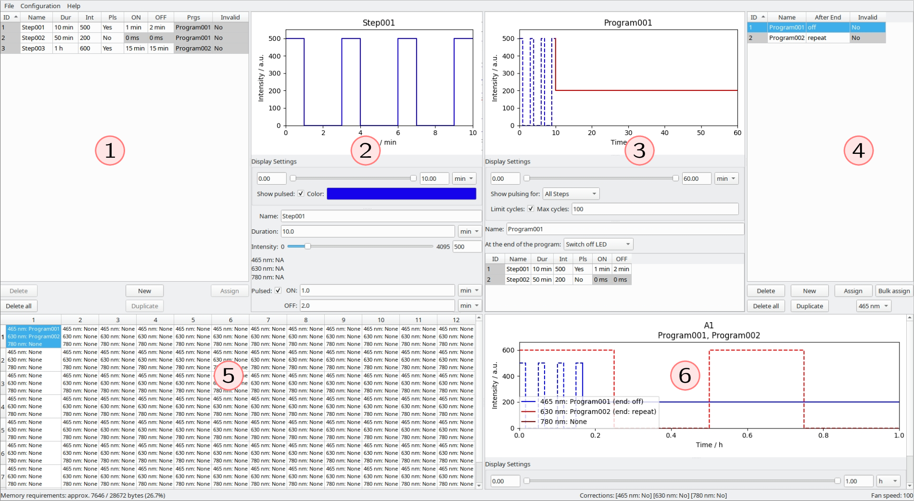

_The main application window._

The application window is separated into a few distinct areas:

1. Step List
2. Step Editor
3. Program Editor
4. Program List
5. Program Assignment
6. Well Viewer

### Step List
> The Step list holds all defined Steps and displays information about them in a tabular format. Steps are the building blocks of Programs. Note that a Step is color-agnostic, i.e. it does not know about the LED it is controlling. Steps have a name and are defined by four parameters (duration, intensity, pulse ON time, pulse OFF time). The time parameters are limited to a resolution of 100 ms and can not be longer than 4294967200 ms (approximately 49 days).

#### Step Parameters
- *Name:*

    A name for the Step to easily find it in the Step list.

- *Duration:*

    The total duration of the Step.

- *Intensity:*

    Intensity of the Step, in arbitrary units from 0 (off) to 4095 (maximum intensity). For pulsed Steps, this is the intensity during the ON phases. During the OFF phases, the intensity is 0. If desired, you may set conversion factors for each LED under _Configuration > Configure Plate..._, in order to display a conversion to physical units.
    **The converted values are only for illustration purposes and do not affect the output!**

- *Pulsed:*

    Indicates if the Step is a pulsed Step or a constant Step. Pulsed Steps always begin in the ON phase. If you need a Step to start with its OFF phase, you can add the Step to a Program and precede it with another Step of intensity 0 and the duration of the OFF phase.

    - *ON:* The duration of the ON phases.

    - *OFF:* The duration of the OFF phases.

#### Table columns

- *ID, Name, Dur, Int, Pls, ON, OFF:*

    ID, name, duration, intensity, _pulsed_ status, pulse ON and pulse OFF time of the Step, respectively. The ID is assigned to the Step automatically and can not be changed.

- *Prgs:*

    The names of all Programs this Step is a part of.

- *Invalid:*

    If a Step is invalid, it cannot be exported to the Arduino. Invalid Steps are highlighted in red, and the cause of invalidity is displayed as a tooltip when you hover over them.

#### Buttons

> Below the Step list, common operations are immediately available.

- *Delete, Delete all:*

    Delete the selected Step, or all Steps at once.

- *New, Duplicate:*

    Create a new Step, or duplicate the selected Step.

- *Assign:*

    Add this Step to the active Program. The active Program is the one displayed in the Program Editor.

#### Context Menu

> Right clicking a Step in the list gives additional options.

- *Set Parameters for All Selected...:*

    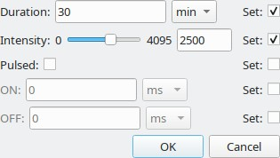

    Opens a dialog in which all Step parameters can be defined. After clicking OK, all parameters for which *Set* was selected are applied to all selected Steps.

- *Interpolate...:*

    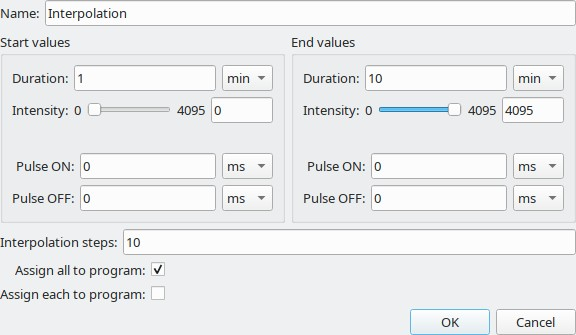

    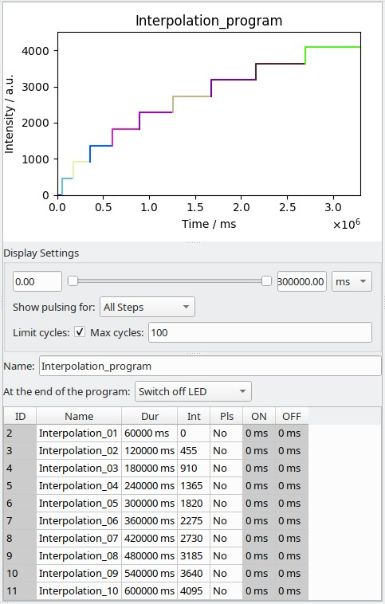

    _The interpolation dialog and the Steps (assembled in a Program) generated by these settings._

    Opens a dialog in which new Steps can be created by linearly interpolating between boundaries for each parameter. The default values for the start and end values correspond to the parameters of the first and last selected Step, respectively. Interpolation can be used to quickly create a gradient illumination pattern, for instance with increasing or decreasing intensity over time.

    - *Name:*

    The prefix that will be added to the start of the names of generated Steps, followed by consecutive numbering. The name "Interpolation" will generate Steps with names Interpolation_1, Interpolation_2, ...

    - *Start values, End values:*

    Set the parameter values to interpolate between here.

    - *Interpolation steps*:

    The number of Steps to generate.

    - *Assign all to program:*

    When this option is selected, a new Program is created which will contain all of the generated Steps in sequence.

    - *Assign each to program:*

    When this option is selected, a new Program is created _for each individual Step_. This can be useful if you want to define gradients across multiple wells. Quickly assigning different programs to wells can be achieved by using the *Bulk assign* operation, see section *Program List* for details.

- *Assign Selected to Program...:*

    Assign the selected Step(s) to a new or existing Program.

---

### Step Editor
> In the Step Editor, parameters are set for the Step which is currently selected in the Step List.

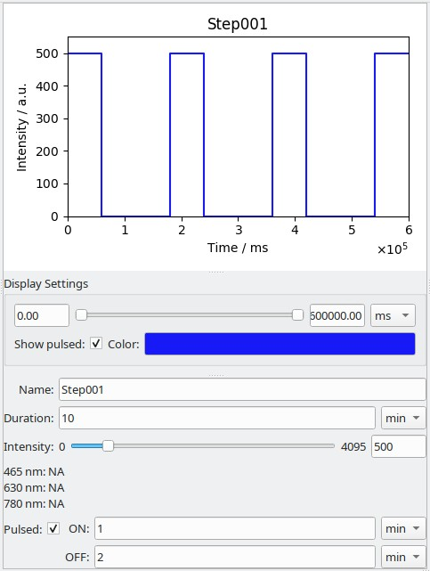

_The Step Editor panel._

#### Display Settings
> These settings do not influence the final Arduino output in any way and only affect how the Step is displayed.

- *Range Slider:*

    The slider allows setting the X axis limits, which may be useful to verify short pulsing times for very long steps. In this case, individual pulses may no longer be clearly discernible.

- *Show pulsed:*

    When this option is turned off, the Step will not be displayed as pulsed. This can be useful for Steps which are very long, with very short pulsing times. This also affects how the Step is displayed in the Program Editor or the Well Viewer, when pulsing display is defined _Per Step_ there. Pulsed Steps which are shown unpulsed are plotted with the ON phase intensity - no averaging is performed.

- *Color:*

    The color used to plot the Step in the Step and Program Editors.

#### Step Parameters
[See the explanation of Step Parameters in the *Step List* section.](#step-parameters)

---

### Program Editor
> A Program is a collection of Steps which can be assigned to one or multiple LEDs.

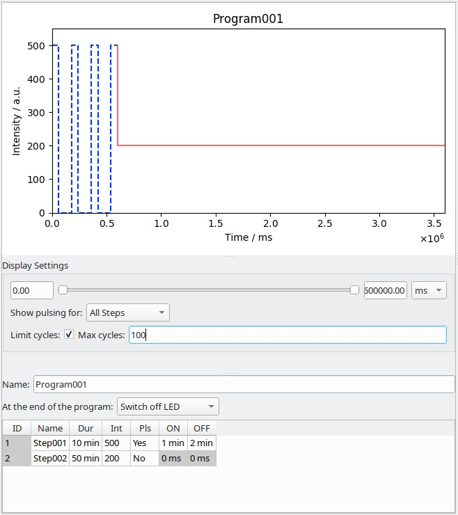

_The Program Editor panel._

#### Display Settings
> These settings do not influence the final Arduino output in any way and only affect how the Program is displayed.

- *Range Slider:*

    The slider allows setting the X axis limits, which may be useful to inspect short and long Steps in the same Program.

- *Show pulsing for:*

    Set this to determine how pulsing cycles are displayed. Depending on the duration of Steps in relation to their pulse on and off duration, the plot may appear visually cluttered, so disabling the pulse display may make it easier to discern. Note that even if pulses are not shown for a particular Step, it is plotted with a dashed line to indicate it is pulsed. Pulsed Steps which are shown unpulsed are plotted with the ON phase intensity - no averaging is performed.

    - *All Steps:*

        Pulsing is shown for all Steps in the Program.

    - *No Steps:*

        Pulsing is shown for no Steps in the Program.

    - *Define per Step:*

        Determine whether to show a Step pulsed by the *Show pulsed* setting of the respective Step.

- *Limit cycles, Mac cycles:*

    When this option is activated, the number of pulsing cycles that can be shown is capped at *max cycles*. As long as all Steps in the active Program taken together do not undergo more pulsing cycles than the specified maximum, pulsing is plotted. When this value is exceeded, Steps are shown as constant to speed up the display. By default, this is set to 100. In this case, adding four Steps with 30 pulsing cycles each would disable pulse plotting for the program.

#### Program Parameters
> A Program is assembled from a sequence of Steps and can be assigned to one or multiple LEDs.

- *Name:*

    A name for the Program to easier find it in the Program list.

- *At the end of the program:*

    Defines what happens after all Steps in the Program were completed.

    - *Switch off LED:*

        After completion of all Steps, the LED to which this Program is assigned is turned off.

    - *Repeat the last step:*

        After completion of all Steps, the last Step in the Program is repeated indefinitely. While it is not possible to export Programs with a total Step duration of more than the maximum (approximately 49 days), this limit may in principle be reached if a Step is set to repeat at the end of the Program. However, **this is not supported**!

    The built-in LED on the Arduino Micro will blink when all Programs have completed all of their Steps at least once - it will also blink when a Program is set to repeat its last Step!

- *List of Steps in the Program:*

    Steps are executed in the order shown here. You can drag and drop Steps to re-arrange them. Right clicking on a Step allows the addition of a new Step to the Program, or removal of an existing Step from the Program.

---

### Program List
> The Program List holds all defined Programs and displays information about them in a tabular format.

#### Table columns

- *ID, Name:*

    ID and name of the Program, respectively.

- *Invalid:*

    If a Program is invalid, it cannot be exported to the Arduino. Invalid Programs are highlighted in red, and the cause of invalidity is displayed as a tooltip when you hover over them.

#### Buttons
> Below the Step list, common operations are immediately available:

- *Delete, Delete all:*

    Delete the selected Step, or all Steps at once.

- *LED Selector:*

    When clicking the *Assign* or *Bulk assign* buttons, the Program will be assigned to the selected wells. This menu specifies the LED to use for the assignment.

- *Assign:*

    Assign the selected Program to the selected Well and LED. To remove Programs from an LED, right click the respective well and choose *Clear programs from selected wells*.

- *Bulk Assign:*

    This option allows assigning multiple Programs to multiple wells. It is only available when the same number of wells and Programs are selected.
    The selected Programs (in the order of selection) are assigned to the selected wells (likewise in the order of selection).

    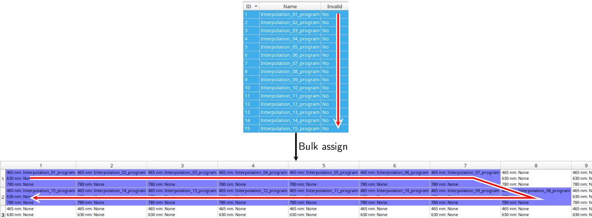

    _The result of a bulk assign operation. The arrows indicate the order of selection for Programs and wells, respectively. Note the names of the assigned Programs._

#### Context Menu
> Right clicking a Program in the list gives additional options:

- *Create dark Step with program duration:*

    For each selected Program, creates a new Step with intensity 0 and duration equal to the sum of all Step durations in the respective Program. For instance, if a Program contains three 10 minute Steps, the dark Step would be 30 minutes long. This can be useful if Programs should be started in a staggered fashion between different wells: A dark Step is added to the start of the Program to achieve a delay.

- *Add program Steps to...:*

    Adds the Steps of all selected Programs to another Program. This allows assembling Programs like building blocks. However, there is no link to the original Program after adding the Steps to another Program: If the source is modified after this operation, the changes will not be reflected in the destination.

---

### Program Assignment
> Here, the Programs which are assigned to the LEDs of a well are displayed.

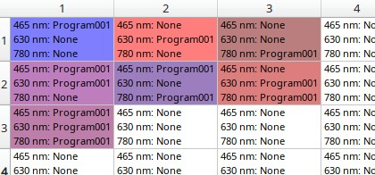

The Program Assignment table is formatted like a multi-well plate: Table rows correspond to plate rows, table columns correspond to plate columns.

Each well can hold one Program per LED, but one Program can be assigned to multiple LEDs. The names of all LEDs are shown in each cell, along with the Program assigned to this LED. To facilitate visually distinguishing the assignment patterns, the table cells are colored with muted variations of the LED colors. If more than one LED is in use, a mixed color is used. You can configure the names and colors of LEDs under *Configuration > Configure Plate...*.

To remove Programs from an LED, right click the respective well and choose *Clear programs from selected wells*.

---

### Well Viewer
> The well viewer displays all Programs in a well at once.

The colors that are used for the LEDs can be set under *Configuration > Configure Plate...* and is independent from the color set for the individual Steps.

#### Display Settings

The display settings are the same as in the Program Editor, with one addition:

- *Show legend:*

    Toggles display of the legend. In the legend, the names of the Programs assigned to each LED are shown, as well as the action taken at the end of the Program (either *off* or *repeat*, as defined for the Program).

---

### Exporting

After defining Steps, creating Programs and assigning them to LEDs, the experimental setup is now ready to be exported to a code file that can be uploaded to the Arduino. To do this, choose *File > Export*. You can either copy the code and paste it into the Arduino IDE yourself, or choose *Open in IDE* to launch the Arduino IDE. Connect the Arduino controlling the optoPlate to your computer. In the Arduino IDE, choose "Arduino Micro" under *Tools > Board*, and select the port to which the board is connected under *Tools > Port*. Then upload by choosing *Sketch > Upload*. For more help on uploading code to the Arduino, see [the Arduino reference](https://www.arduino.cc/en/Guide/Environment#uploading).

Please note that LEDs may light up erratically if power is restored to the Arduino Micro while it is connected to a computer via a Micro-USB cable. To restore proper functionality, press the reset button on the Arduino, or disconnect the Arduino from your computer and turn the power off and back on again.

---

### The Configuration Menu

#### Preferences

In the preferences, you can set the path to the Arduino IDE, in order to directly launch it from the Export window.

#### Configure Plate
> The plate configuration allows to set the grouping mode and the characteristics of LED types.

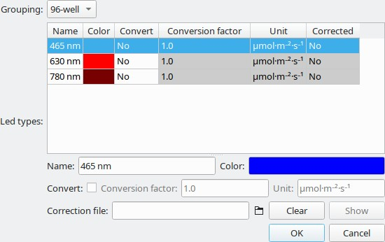

- *Grouping:*

    You can choose to assign Programs to each of the 96 wells of the optoPlate individually (*96-well*), or you can select (*24-well*) to perform assignment to groups of 4 wells, mimicking the layout of a 24-well plate. Note that changing the Grouping setting will reset all Program assignments.

- *LED types:*

    - *Name:*

        The name of the LED is used in the Program Assignment table and the Well Viewer and is only relevant for display purposes.

    - *Color:*

        The color assigned to an LED is used in the Program Assignment table and for the plots in the Well Viewer. It is only relevant for display purposes.

    - *Convert, Conversion factor, Unit:*

        If desired, a conversion factor can be entered to convert arbitrary units to physical units. This is shown in the Step Editor and can facilitate setting the necessary intensity for a Step. It is only relevant for display purposes, however, and has no effect on the exported intensities.

    - *Correction file:*

        You can specify the path to a .csv file which holds correction factors for LEDs.
        The file should be a comma-separated list of values, which can be exported from standard spreadsheet software. In both Microsoft Excel or LibreOffice Calc, .csv files can be saved by choosing *File > Save As* and selecting .csv as the file type. The layout of the table must correspond to the layout of a multi-well plate (table rows to plate rows, table columns to plate columns).

        Each correction factor is a multiplication factor between 0.0 and 1.0. When a Program runs on the optoPlate, each intensity is first multiplied by the correction factor before it is written to the LED. When a valid file was specified, the correction matrix can be shown with the *Show* button. This feature can be used to reduce illumination differences between different wells, or to easily define intensity gradients over multiple wells of the plate, without having to define many Steps and Programs - simply assign the same Program to all LEDs and let the correction handle the creation of the gradient.

        Note that each LED type has its own correction factors and that they are not shared!

        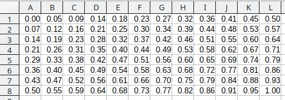

        _Correction factors in a spreadsheet._

        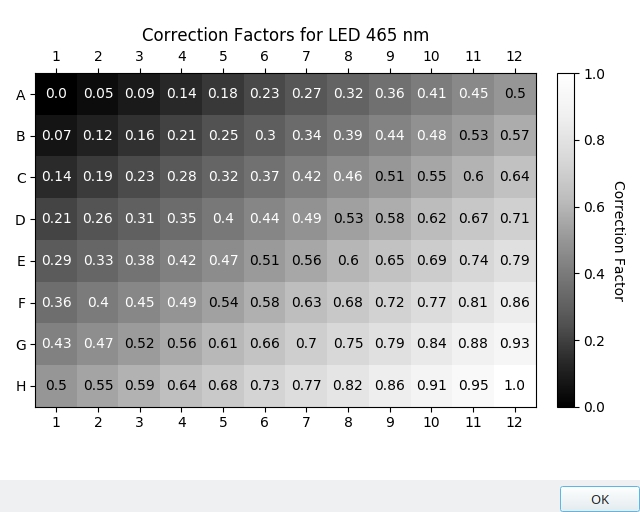

        _Correction factors applied to an LED._

#### Set Fan Speed

You can adjust the fan speed of the fan on the optoPlate from 0 (off) to 255 (maximum speed). The default value is 100. The fan speed needed to provide sufficient cooling will depend on the heat generated by the optoPlate during the protocol, which depends on the numbere of activated LEDs and their intensities.

---

### The Status Bar

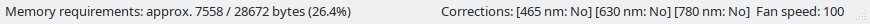

- *Memory requirements:*

    Displays an approximation of the storage space that will be required by the current configuration. The exact value varies between the platform and the version of the Arduino IDE, even for the same code. However, it can give you an indication of whether your current configuration is approaching the limits of the Arduino Micro.

- *Corrections:*

    Indicates which LED types have correction factors associated with them.

- *Fan speed:*

    Indicates the currently set fan speed. Adjust it under *Configuration > Set Fan Speed ...*

### The Help Menu

#### About

Show information about optoConfig-96.

#### Examples

You can pick from several example files made with optoConfig-96. These mostly replicate the [quality control scripts provided with the optoPlate-96](https://github.com/BugajLab/optoPlate-96/tree/master/2.%20Code/1.%20Arduino/2.%20QCscripts). Choosing one will open it.

#### User Guide

Opens the optoConfig-96 user guide in a browser.